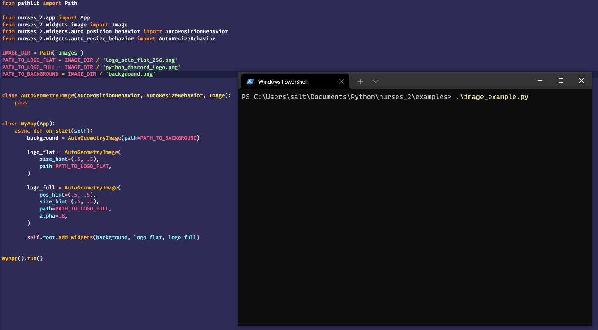
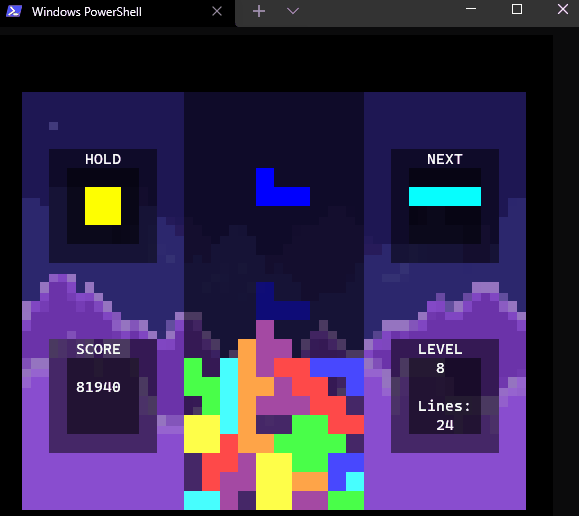

# nurses_2 - terminal graphics

> A continuation and rewrite of [nurses](https://www.github.com/salt-die/nurses) depending on [prompt-toolkit](https://github.com/prompt-toolkit) instead of curses.`nurses_2` is meant for vt100 enabled, true color terminals.  (No support otherwise.)

This is a widget and async-centric library for creating graphical applications in the terminal. Why would you want to create graphical applications in a terminal? Because you like to!

# /examples/basic_example_1.py

# /examples/exploding_logo.py

# /examples/button_example.py

# /examples/image_example.py

# /examples/exploding_logo_redux.py

# /examples/sandbox

# /examples/raycaster

# /examples/tetris

