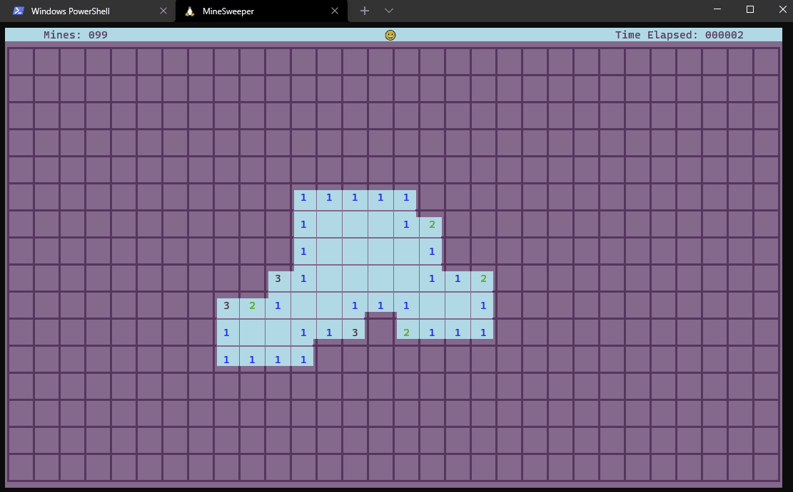
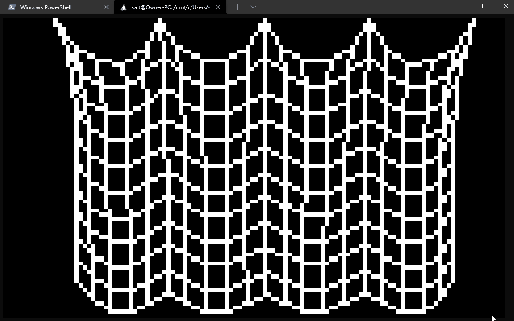

# nurses_2 - terminal graphics

This is a widget and async-centric library for creating graphical applications in the terminal. Support only for vt-100 enabled, truecolor terminals.

Getting Started
---------------
To create a nurses_2 app, inherit the `App` class and implement the `on_start` asynchronous method. Please see examples in the `/examples/` directory.

# /examples/exploding_logo.py

# /examples/exploding_logo_redux.py

# /examples/sandbox

# /examples/raycaster

# /examples/tetris

# /examples/rubiks

# /examples/minesweeper

# /examples/cloth

